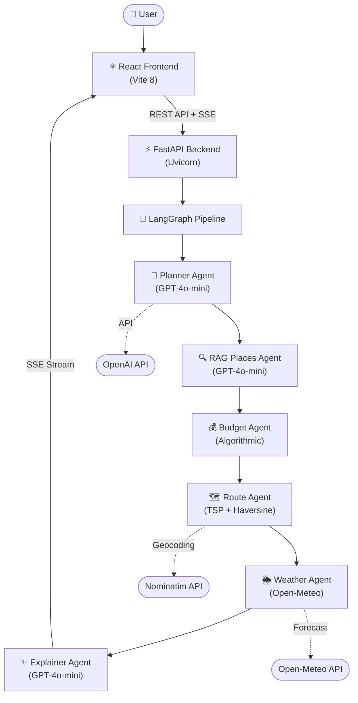

# ✈️ AI Travel Copilot

     

> A full-stack AI-powered travel planning application that uses a **multi-agent LangGraph pipeline** to generate personalized, budget-optimized travel itineraries with real-time weather data, GPS-based route optimization, and an interactive chat assistant.

---

## ✨ Features

- 🧠 **Multi-Agent AI Pipeline** — 6 specialized LangGraph agents working in sequence
- 🔍 **RAG-Powered Recommendations** — Context-aware hotel, restaurant & attraction suggestions
- 🗺️ **Interactive Route Map** — Leaflet.js map with numbered markers and optimized route polyline
- 💰 **Smart Budget Planner** — City-specific cost estimation with interactive Recharts visualizations
- 📄 **One-Click PDF Export** — Download your complete itinerary as a formatted PDF
- 🌦️ **Real-Time Weather** — Live forecast integration via Open-Meteo API
- 💬 **AI Chat Assistant** — Conversational travel advisor with full chat history
- 📊 **TSP Route Optimization** — Nearest-Neighbor heuristic with Haversine GPS distance
- ⚡ **Real-Time Streaming** — Server-Sent Events for live agent progress updates

---

## 🏗️ System Architecture



---

## 🛠️ Tech Stack

| Layer | Technology |
|-------|------------|
| **Frontend** | React 19, Vite 8, Leaflet.js, Recharts, jsPDF |
| **Backend** | Python 3.12, FastAPI, Uvicorn |
| **AI / ML** | LangGraph, LangChain, OpenAI GPT-4o-mini |
| **DSA** | NetworkX, Nearest-Neighbor TSP, Haversine Formula |
| **APIs** | Open-Meteo (Weather), Nominatim (Geocoding) |
| **Deployment** | Vercel (Frontend), Render (Backend) |
| **Testing** | pytest, GitHub Actions CI/CD |

---

## 📁 Project Structure

```
ai_travel_planner/
├── backend/
│   ├── main.py                    # FastAPI app entry point
│   ├── requirements.txt
│   ├── .env                       # OPENAI_API_KEY
│   ├── app/
│   │   ├── agents/
│   │   │   └── travel_graph.py    # LangGraph 6-agent pipeline
│   │   ├── api/
│   │   │   └── routes.py          # REST endpoints
│   │   ├── models/
│   │   │   └── schemas.py         # Pydantic schemas
│   │   ├── services/
│   │   │   ├── chat_service.py    # AI chat assistant
│   │   │   ├── country_service.py # Country metadata (offline DB)
│   │   │   ├── geo_service.py     # Nominatim geocoding
│   │   │   ├── route_optimizer.py # TSP + Haversine DSA
│   │   │   └── weather_service.py # Open-Meteo integration
│   │   └── rag/
│   │       └── mock_data.py       # Seed data for RAG
│   └── tests/
│       └── test_services.py       # pytest test suite
├── frontend/
│   ├── src/
│   │   ├── App.jsx                # Main app with tabs
│   │   ├── components/
│   │   │   ├── TripForm.jsx       # Trip input form
│   │   │   ├── ItineraryView.jsx  # Itinerary display
│   │   │   ├── MapView.jsx        # Leaflet interactive map
│   │   │   ├── BudgetCharts.jsx   # Recharts visualizations
│   │   │   ├── PdfExport.jsx      # PDF download
│   │   │   └── ChatView.jsx       # AI chat interface
│   │   └── services/
│   │       └── api.js             # API client + SSE handler
│   └── package.json
├── .github/workflows/ci.yml       # GitHub Actions CI
├── render.yaml                    # Render deployment config
└── README.md
```

---

## 🚀 Getting Started

### Prerequisites
- Python 3.10+
- Node.js 18+
- OpenAI API Key ([Get one here](https://platform.openai.com/api-keys))

### Backend Setup
```bash
cd backend
python -m venv venv
venv\Scripts\activate       # Windows
# source venv/bin/activate  # macOS/Linux
pip install -r requirements.txt

# Create .env file
echo OPENAI_API_KEY="your-key-here" > .env

# Start server
uvicorn main:app --reload --port 8000
```

### Frontend Setup
```bash
cd frontend
npm install
npm run dev
```

Open https://al-travel-agent.vercel.app/ and start planning! 🌍

---

## 📡 API Endpoints

| Method | Endpoint | Description |
|--------|----------|-------------|
| `POST` | `/api/plan-trip` | Generate full itinerary via multi-agent pipeline (SSE stream) |
| `POST` | `/api/chat` | Conversational travel assistant |
| `POST` | `/api/optimize-route` | Standalone TSP route optimization |
| `GET` | `/` | Health check |

---

## 🧮 DSA Highlights

### Nearest-Neighbor TSP Heuristic
- **Complexity**: O(n²) — optimal for itinerary-scale datasets (< 30 stops)
- **Algorithm**: Greedy selection of nearest unvisited node at each step
- **Distance**: Haversine formula for great-circle GPS distance

### Haversine Formula
```
d = 2R × arcsin(√(sin²(Δφ/2) + cos(φ₁)·cos(φ₂)·sin²(Δλ/2)))
```
Calculates the shortest distance between two points on Earth's surface using latitude/longitude.

### Graph Construction
- **NetworkX** complete weighted graph with Haversine edge weights
- Real GPS coordinates from **Nominatim** (OpenStreetMap) geocoding
- Deterministic fallback with city-center scatter for rate-limit resilience

---

## 🧪 Testing

```bash
cd backend
python -m pytest tests/ -v
```

---

## 👤 Author

**Yuvraj Kag**  
📍 IIIT Bhopal · B.Tech ECE (2023-2027)

[](https://linkedin.com/in/4uvraj)
[](https://github.com/4uvraj)

---

## 📄 License

This project is licensed under the MIT License.
